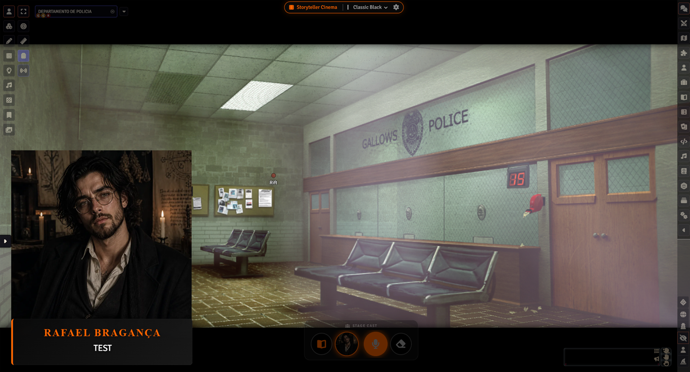
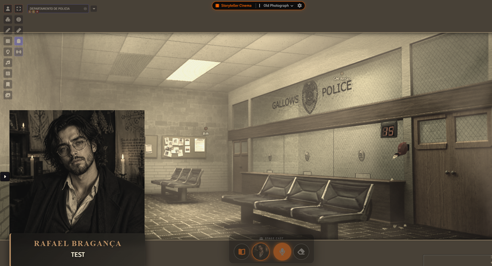

# Storyteller's Cinema

**Storyteller's Cinema** transforms your Foundry VTT sessions into an immersive **visual novel experience**. It introduces a powerful, non-destructive **Cinematic Overlay** that instantly elevates roleplay. With a single click on the HUD, the tactical battlemap transitions into a scenic, atmospheric stage with widescreen cinematic bars, expressive character portraits, dynamic subtitles, and mood filters—all while preserving your underlying map assets and keeping tactical gameplay just a toggle away.

 

## 🌟 Core Features

* **Cinematic Stage (Dialogue & Subtitles):** Elevate your roleplay with beautiful dynamic subtitles and large, expressive character portraits that appear alongside dialogue.
* **Stage Cast (Cinema Tray):** A dedicated, floating control bar for the GM. Activate **Director Mode** to automatically intercept chat messages and broadcast them as cinematic subtitles directly onto the screen.
* **Smart Occlusion Engine (V14 Native):** When Cinematic Mode is active, tactical elements (grid, tiles, drawings, and non-portrait tokens) are intelligently hidden. This leaves a pure, immersive scene without needing to delete any map assets!
* **Per-Scene Customization:** Assign dedicated widescreen background images to specific scenes and choose whether a scene defaults to Tactical (top-down) or Cinematic mode upon loading.

## ✨ The Skin Studio

Gone are the days of static black bars. Storyteller's Cinema features a powerful in-app theme engine:

* **Design Your Own UI:** Change the cinematic borders from simple black bars to Wood, Stone, Sci-Fi Neon, or Parchment directly inside Foundry.
* **Live Preview:** See changes instantly as you tweak textures, heights, and borders.
* **Cinematic Filters:** Apply full-screen overlays like **Film Grain**, **Old Paper**, or **Vignettes** to set the perfect mood.

## 🔄 Smart Import & Community Themes

Share your creations with the world easily using the new **Smart Importer**:

* **Drag & Drop Installation:** Found a cool theme JSON on Discord? Just drag it into the module settings.
* **Offline Ready (Auto-Downloader):** The smart importer automatically fetches referenced images (from the web) and **saves them locally** to your user data folder. Your themes will work forever, even without internet.

## 📦 Installation
1.  Copy the Manifest Link from the latest Release.
2.  In Foundry VTT, go to **Add-on Modules** -> **Install Module**.
3.  Paste the link and install.

## ⚙️ Compatibility
Fully compatible with and validated for **Foundry VTT v14**.

## 📝 License
[GNU General Public License v3.0](LICENSE)
